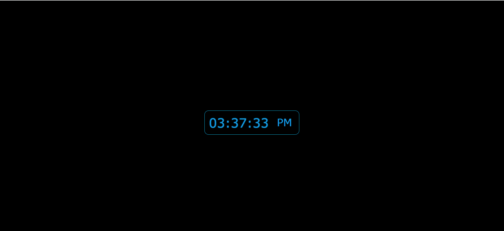

# Coding Challenge : Digital Clock

## Description

With this project, I aim to make a digital clock.

## Project Skeleton

```
007-Digital-Clock(folder)
|
|----readme.md
|----solution
        |----index.html
        |----style.css
        |----app.js
```

## Expected Outcome



## Objective

Creating a Digital Clock website

### I covered the following topics in my project:

- HTML

- CSS

- JS
